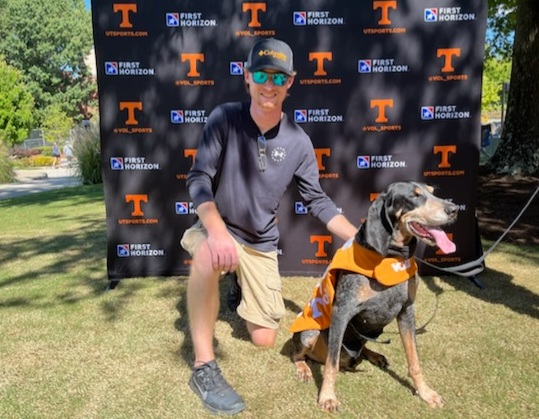

# Zach Dorminey
My name is Zach Dorminey. I am a first year PhD student in Geography at the Department of Geography and Sustainability at the [University of Tennessee, Knoxville](https://utk.edu) (UTK). I am focusing on quantitative methods in geographical information systems (GIS).

## Background
I am from Morgantown, West Virginia where I grew up and attended [West Virginia University](https://www.wvu.edu/) (WVU). I graduated from WVU with a BS in Civil Engineering and worked for about 2 years in the industry. After exploring some opportunities in geography, I decided to go back to school and pursue in-depth quantitative methods in geography. This past summer, upon successful defense of my thesis "A Multi-Metric Approach to Fay-Herriot Small Area Estimation of Forests", I graduated with an MS in Geography.

## Research
My research interests include small area estimation, cluster analysis methods, and quantitative methods as a larger body of study. All my work points to my fascination with different methods to account for spatially related phenomena. I enjoy reading the original works foundational to quantitative methods in geography and learning how those works are vital to cutting edge research today.

### Presentations
Most recently I presented a portion of my MS thesis work "Small Area Estimates of Virginia's Forests from Coast to Mountains: How does canopy height help?" at the 2024 Annual Meeting of the Association of American Geographers in Honolulu, Hawaii.

My more recent presentations include co-authorship on a presentation "Examining Inaccuracies in Small Area Estimation" at the SOMENS and NEMO Joint Meeting in 2023. 

My early research work, Assessing the Spatial Clustering of Right of Way Permits in Davidson County, Tennessee, utilized Ripley's K function to compare the clustering tendencies of right of way permits to the distribution of addresses. I developed an R Shiny app in this work so that my methods are easily visualized and repeated with different datasets without the need for the user to have experience with GIS. I presented a poster on this work at GeoSym 2023 at UTK and at AAG 2023 Annual Meeting in Denver.
<!--Include the -->
```R
#Some of my favorite packages in R:
library("shiny")
library("sf")
library("spatstat")
library("rFIA")
```
## Relevant Coursework
- GEOG 411 - Intermediate GIS
- GEOG 510 - Geographic Software Design
- GEOG 515 - Quantitative Methods in Geography
- STAT 578 - Categorical Data Analysis

## Research Assistant
I am a GRA at the Office of Innovative Technologies in the Research Computing Support group. In this role, I support the professional research consultants in aiding researchers throughout the UT system with statistics and GIS related work.

## Teaching
In my time at UTK I have worked as a Graduate Teaching Assistant, serving as a TA for:
- GEOG 131 Weather/Climate/Climate Change
and 
- GEOG 132 Landscapes and Environmental Change


## Go Vols!
<!-- Markdown will also render HTML-->
<!-- for an image-->


<!--👋-->

<!--
**ZachDorm/ZachDorm** is a ✨ _special_ ✨ repository because its `README.md` (this file) appears on your GitHub profile.

Here are some ideas to get you started:

- 🔭 I’m currently working on ...
- 🌱 I’m currently learning ...
- 👯 I’m looking to collaborate on ...
- 🤔 I’m looking for help with ...
- 💬 Ask me about ...
- 📫 How to reach me: ...
- 😄 Pronouns: ...
- ⚡ Fun fact: ...
-->
